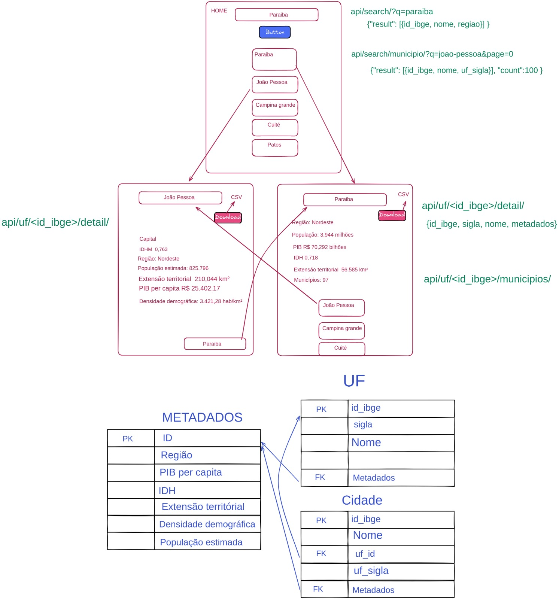

# Municípios

Projeto que utiliza template do [Tony Lâmpada](https://github.com/tonylampada)combinando um frontend (Vue|Nuxt.JS|Vuetify) e Backend Python (Django API).

## O que está incluso?

- Ambiente baseado em containers (docker) e docker compose, início com mínimo de esforço
- Integração entre FRONTEND e BACKEND prontos para produção
- Autenticação configurada para funcionar com o Django (cookies)
- Estrutura de pastas para facilitar escalar e organizar o projeto
- Estilo de código configurados para o BACKEND (flake8) e FRONTEND (eslint)
- Exemplo funcional de um todo-list com listar/incluir
- BACKEND: [Django](https://www.djangoproject.com/) e Postgres
- BACKEND: Teste configurado com exemplos (usando [Pytest](https://docs.pytest.org/)) para promover TDD
- FRONTEND: [Vue 2](https://v2.vuejs.org/), [Vuetify](https://vuetifyjs.com/en/getting-started/quick-start) e [Nuxt](https://nuxtjs.org/) (usando vue cli) separado do backend
- FRONTEND: Modo sem backend usando [mock-apis](https://medium.com/@tonylampada/javascript-mock-api-why-you-might-want-to-have-one-232b3ba46b12) para promover a validação rápida de ideias


## Requisitos

- Node 14 instalado (digite `node -v` para ver a versão) e conseguir rodar o [vue-cli](https://cli.vuejs.org/)
- Docker & Docker compose instalados para subir tudo muito rápido e não precisar instalar/configurar infinitas libs/ferramentas diretamente na sua máquina

### Primeiro passo

Vamos precisar criar o projeto e fazer o build de tudo, utilize os comandos abaixo:

```bash
# Digite o comando abaixo, caso ainda não tenha o comando vue
$ npm install -g @vue/cli
# Instale as dependências do front
$ npm install
# Mude para pasta do projeto
$ cd consultorIbge
# Para criar os containers
$ docker compose build
# Para iniciar os containers
$ docker compose up -d
```

Depois de fazer o build e iniciar todos containers, fazendo um `docker ps` é possível ver que temos os seguintes serviços rodando:

```
$ docker ps
CONTAINER ID   IMAGE                  COMMAND                 NAMES
a72fb2ab3ba2   back-todoten           "wait-for-it localho…"  municipios_backend_1
6ef83aab15e5   front-todoten          "docker-entrypoint.s…"  municipios_frontend_1
6def45b54094   nginx                  "/docker-entrypoint.…"  municipios_nginx_1
93e76c660729   postgres:13.3-alpine   "docker-entrypoint.s…"  municipios_postgres_1

```

E estes containers estão organizados como no diagrama abaixo:


🚀 Para acessar os serviços, utilize as URLs abaixo:

- `http://localhost` para acessar o frontend
- `http://localhost/api` para acessar diretamente alguma rota da API
- `http://localhost/admin` para acessar o Django admin

📝 NOTA: Embora o frontend está em `http://localhost:3000`, não faz muito sentido acessar esta URL diretamente. Utilize `http://localhost` para acessar o front, desta forma o NGINX vai intermediar e saber redirecionar requisições feitas pelo frontend para `http://localhost/api`, ou seja, acessando com a porta 3000, as requisições /api não funcionam.

Para conseguir logar, vamos precisar criar um usuário no Django. Podemos fazer isto entrando no container backend e rodar o comando do Django `./manage.py createsuperuser`:

```
$ docker compose exec backend ./manage.py createsuperuser

Usuário (leave blank to use 'root'): admin
Endereço de email: admin@example.com
Password:
Password (again):
Superuser created successfully.

```

📝 NOTA: Também podemos acessar diretamente o container do backend usando `docker exec -it municipios-backend-1 bash` e ai digitar o comando que quisermos, mas temos que ter atenção que o prefixo do nome do container muda conforme o nome dado na criação do projeto.

### Passo 2

Para preparar o ambiente para que seja possível evoluir o frontend, dado que algumas pastas foram geradas pelo processo de build do docker, vamos precisar fazer alguns ajustes:

```
# Mudar o dono da pasta de root para o seu usuário
$ sudo chown 1000:1000 -Rf frontend/
$ cd frontend
$ npm install

# Para garantir que tudo está funcionando, o comando abaixo tem que rodar sem dar erro:
$ npm run lint
  > frontend@1.0.0 lint /home/user1/workspace/municipios/frontend
  > npm run lint:js
  > frontend@1.0.0 lint:js /home/user1/workspace/municipios/frontend
  > eslint --ext ".js,.vue" --ignore-path .gitignore .

```

Se conseguiu ver a saída acima, tudo esta funcionando!

Para parar todos os containers, utilize o comando abaixo:

```
$ docker-compose down
  Stopping municipios_backend_1  ... done
  Stopping municipios_frontend_1 ... done
  Stopping municipios_nginx_1    ... done
  Stopping municipios_postgres_1 ... done
```

📝 NOTA: Utilize o comando `docker ps` e garanta que nenhum container está rodando


## Subindo apenas o frontend (backend-less)

Para algumas demandas de trabalho, faz sentido alterar primeiro o frontend, e assim não faz sentido subir
o backend com banco de dados. No Djàvue temos o conceito de API MOCK. ou seja, subir apenas o front com um imitador de backend (mock). Em ouras palavras, subir apenas código JavaScript e nada de Python ou qualquer outra tecnologia.

Para isto, ao invés de utilizar o `docker-compose up` apresentado no início, vamos utilizar uma pequena variação:

```bash

$ docker-compose -f docker-compose.yml -f docker-compose.apimock.yml up frontend

```

🚀 Para acessar os serviços, utilize as URLs abaixo:

- `http://localhost` para acessar o frontend
- `http://localhost/api` para acessar diretamente alguma rota da API MOCK

📝 NOTA: Rode um `docker ps` e veja que temos rodando um imitador de backend (que está na pasta `apimock`) em código NodeJS com [Express](https://expressjs.com/).


Para consultar os logs dos containers existe:

docker logs -f municipios-backend-1# cidad.es


